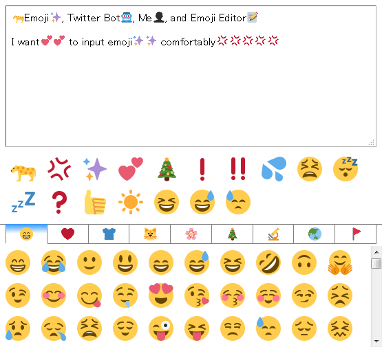

# Emoji Editor

Simple WYSWIG Emoji Editor based on HTML.

## Requirements

Something Web browser which supports modern Web technologies.
(Basically tested on Mozilla Firefox 50.0.x.)

Here is the list of depending technologies:

* HTML5
* `copy`, `cut`, `paste`, `compositionstart` and `compositionend` DOM events
* `delete`, `insertHTML`, and `insertText` commands for `document.execCommand()`
* MutationObserver
* Generator
* localStorage
* DOM3 XPath

## How to use

Open the file `emoji-editor.html` by your modern web browser. You'll see colorized emoji palette if you are using something web browser who supports colorized emoji natively, for example Firefox 50 and later.
If you deploy the file to the Web, twemoji will be loaded automatically and all emojis are rendered by twemoji.

Additionally, you can copy just one emoji to the clipboard, by long-pressing on the palette (while 1sec.)

You can change some behaviors by editing the source. Open the file with any text editor and change attribute values of the root element. Available configs:

 * `data-max-recent-items`: Number of recently used items.
 * `data-long-press-seconds`: Seconds to detect "long press" on items.

## Known issues

 * There is no "Save" and "Load" feature. You need to copy/paste the constructed emoji text between something text editor which support  UTF-8 (atom, sublime, or something).
 * On Google Chrome, it fails to calculate the position of hte cursor, so the cursor can go away if you insert Unicode emoji characters directly from IME or others. This problem is caused by undocumented behavior around `contenteditable="true"` on Chrome.
